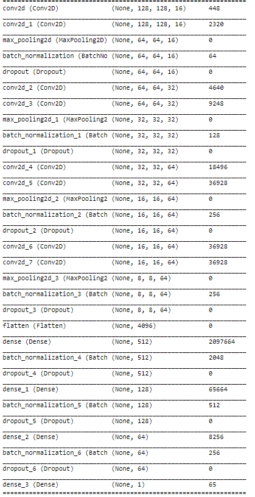
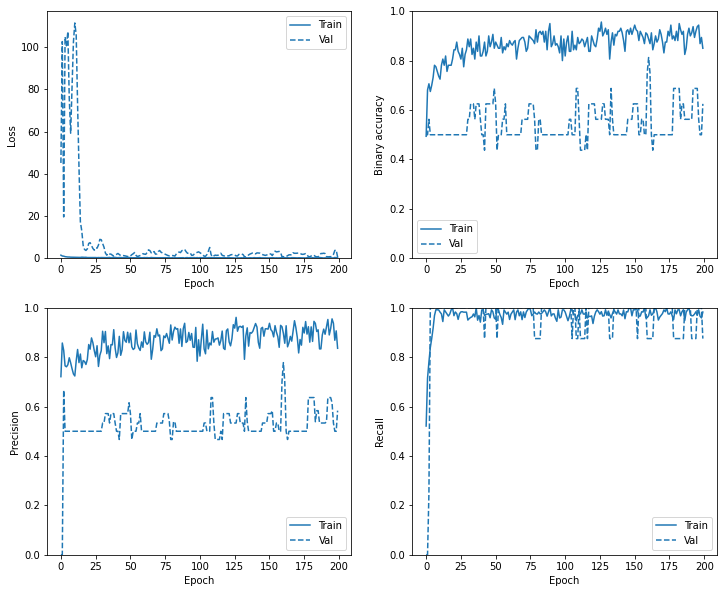
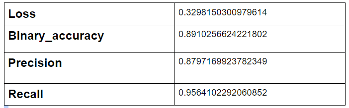

# Pneumonia Detection using CNN

## A CNN model which can predict Pneumonia using Chest X-ray

This project contains a CNN architecture (inspired by vgg16). 
We trained our model on 5216 training examples and 16 examples as validation dataset. Applied Data augmentation and by   
customizing the Class weights model was able to classify Chest X-ray with 90% accuracy.  
## **Architecture** :  
  

## **Results** :  
  
  

## Getting Started

### Dependencies

* Python 3.5–3.8
* pip 19.0 or later (requires manylinux2010 support)
* Ubuntu 16.04 or later (64-bit)
* macOS 10.12.6 (Sierra) or later (64-bit) (no GPU support)
* Windows 7 or later (64-bit)
* Microsoft Visual C++ Redistributable for Visual Studio 2015, 2017 and 2019
* GPU support requires a CUDA®-enabled card 

### Installing

* Pip install tensorflow
* Pip install keras
* Pip install seaborn

## Version History

* 0.1
    * Initial Release
 
